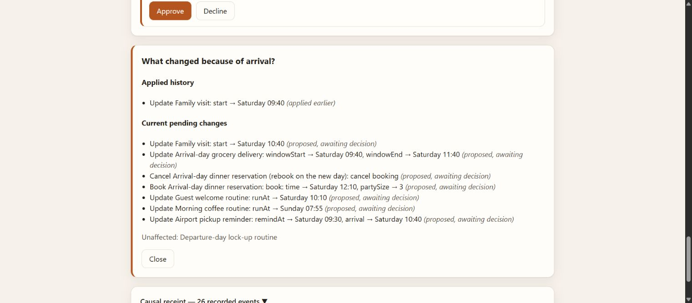
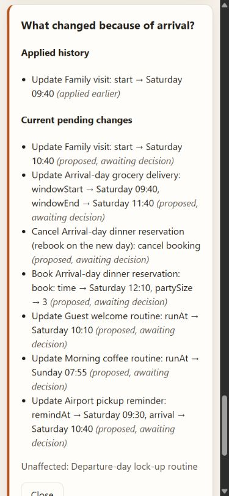

# Causal recall: applied history and current pending operations

Base: `ba01652aaee47eb5e220cdb1bce6339f265b0349` (the open-panel refresh fix).

## Reproduction

Apply the arrival fact change to Saturday 09:40, approve and execute only Family
visit, then change arrival to Saturday 10:40. Previously even a fresh engine
recall returned only the earlier applied 09:40 row for that commitment. The
simulator now shows **Applied history** with 09:40 and **Current pending changes**
with proposed 10:40. Approval updates only the pending row; successful execution
adds another history entry and removes that pending operation.

## Additive contract

`recallByFact(world, fact, now?)` retains `fact`, `changedCommitments`, and
`unaffected` with their existing compatibility behavior. New consumers should
use these additive fields:

- `appliedHistory`: successfully executed causal operations, ordered by execution
  ledger sequence. Each carries operation `id`, `commitmentId`, `kind`, `label`,
  `factsVersion`, `changedBy`, separate `before`, `after`, and `patch`, plus
  `state: applied`, `executedSeq`, and simulated `executedAt`.
- `pendingOperations`: current-revision proposed or approved operations in the
  latest change set, retaining the same operation identity and provenance fields.
  Expired, superseded, declined, rejected, and executed operations are excluded.
- `unaffectedCommitments`: live commitments absent from both new operation lists.

The supplied time is simulated epoch milliseconds. Omitted time defaults to the
last journal input time, never wall time. Reads do not advance the clock, expire
stored operations, write events, or change consent. New nested snapshots are
detached from the world. Provenance uses explicit `changedBy` stamps, with the
existing dependency fallback for legacy unstamped operations. Cancel and rebook
remain separate operations, even when they share a commitment ID.

MCP `get_receipt` adds `structuredContent.recall` with this same response, using
the wrapper's existing fixed simulated clock. Existing `ok`, `fact`, `ops`,
`events`, and text output are preserved. No MCP lifecycle changes are involved.

## Verification

- Engine: 77 tests pass, including seven new regressions covering proposed,
  approved and executed transitions; decline and clock expiry; supersession and
  recheck; A→B→A; cancel/rebook execution order and rejection omission; budget
  provenance; detached snapshots; replay, reload and read purity.
- Simulator: 22 tests pass. Nine mounted recall tests compare rendered operation
  rows with a fresh engine read of the persisted world, including concurrent
  history/pending, approval/execution, decline, expiry, supersession, recheck,
  Close, reset, reopening, and persisted remount.
- MCP: 12 tests pass. HTTP receipt parity checks preserve old fields and compare
  the additive recall with the direct engine through proposal, approval,
  execution, a newer proposal and decline. Existing browser-client tests pass.
- Lint, engine/simulator typecheck and production build pass. The build retains
  the existing harmless Zod dependency annotation warnings.
- Actual Chrome checks: Enter previews/applies arrival, opens recall, approves
  and executes Family visit. A subsequent 10:40 proposal appears alongside the
  applied 09:40 history. Keyboard Close/reopen and browser reload show persisted
  world state.
- Desktop and 390×844 layouts inspected. At 390 px, document scroll width is
  375 px and recall width is 351.2 px, with wrapping and no horizontal overflow.
  Viewport override reset. Recall rows have animation `none` and transition `0s`;
  the existing reduced-motion CSS also disables transitions and hero animation.

This patch changes only causal reads, presentation, additive receipt output,
tests and documentation. Execution, consent hashes, fees, fixtures, persistence
schema and journal replay remain unchanged. Existing video and submission fields
are unchanged. Publication is a draft PR; no merge or production deployment is
included.
