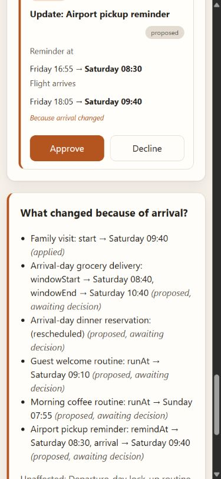

# Open causal recall verification

Base: `c94a35364e89b6556614aa635673c8d35739bf54`.

## Reproduction and fix

On the deployed offline simulator, select **Move arrival to Saturday 9:40**,
apply the preview, ask **What changed because of the flight?**, approve
**Family visit**, then apply the approved change. Before this patch, the calendar
and operation update, but the open recall still says **proposed, awaiting decision**.
Asking again returns the correct applied result.

The UI now retains only the selected fact and derives recall from the current
world during render. The open panel updates immediately to **approved, awaiting
apply**, then **applied**, without repeating the question.

## Checks

- Five mounted React regressions compare panel rows, patches, statuses and
  unaffected commitments with fresh engine recall from the persisted world.
  They cover proposed/approved/executed, decline, superseding arrival restoration,
  clock expiry, recheck, Close/reopen, reset, and persisted remount.
- Before the fix, the lifecycle comparisons reproduced four stale-response
  failures. All five tests pass with the fix.
- All existing suites pass: engine **70**, simulator **18** (including the five
  new tests), MCP **11**; total **99**. Lint, strict typecheck and production
  build pass. Build emits dependency annotation warnings from Zod.
- Actual Chrome checks: Enter activates the arrival chip; preview initially
  focuses Apply change; Shift+Tab/Tab stays inside the preview; keyboard approval
  and execution update the already-open panel. Close/reopen and browser reload
  show persisted applied state.
- At **390 × 844**, recall wraps and remains keyboard accessible. Document
  scroll width was **375 px**, within the **390 px** viewport. Viewport override
  was reset after testing.
- Independent read-only reviewer found no actionable UI regression. Its own
  test attempt hit sandbox child-process restrictions; executed suite results
  above were supplied by the implementing agent.

Actual browser screenshot after execution and persisted reload:

## Separate existing engine limit

Execute the Family visit arrival change to `2026-10-17T09:40`, then edit arrival
to `2026-10-17T10:40` without executing the new proposal. The newest calendar
operation is proposed with `start: 2026-10-17T10:40`, but a fresh
`recallByFact(world, 'arrival')` still returns the earlier `09:40` patch as
applied. The engine ranks prior applied results above later pending results for
the same commitment in `packages/engine/src/store.ts`.

The independent reviewer and implementing agent reproduced this directly with
the engine. It is outside this UI snapshot fix. Engine behavior, consent hashes,
fees, fixtures, persistence schema, MCP, existing video and Devpost fields are
unchanged. The branch is intended for a draft PR; no merge or deployment is part
of this verification.
